#  Comandos de GIT

- `git help`
  Muestra todos los comandos usables en git y muestra informacion general del git como la version  
   
- `ls`
  Enlista todos los directorios disponibles 
  
- `git config --global user.name "Tu Nombre"`  
  Define el nombre de usuario global para los commits. 
  
- `git config --global user.email "tu@email.com"`  
  Define el correo electrónico global para los commits. 
  
- `git config --list`  
  Muestra la configuración actual de Git. 
  
- `git init`  
  Inicializa un nuevo repositorio Git en el directorio actual. 
   
- `git clone https://github.com/johansmith32/ComandosGit.git`  
  Clona un repositorio local. 
  
- `git branch -m "nombre"`
  Renombra la rama en la que esta ubicada la persona 
  
- `git status`  
  Muestra el estado de los archivos (modificados, sin seguimiento, etc.). 
  
- `git add archivo.txt`  
  Agrega un archivo específico al área de preparación (staging). 
  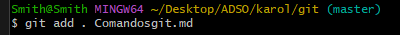
- `git add .`  
  Agrega todos los archivos modificados al área de preparación. 
  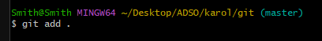
- `git reset archivo.txt`  
  Quita un archivo del área de preparación. 
  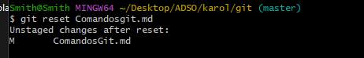
- `git commit -m "Texto commit"`  
  Crea un commit con los archivos en staging y un mensaje descriptivo. 
  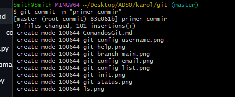
- `git log`  
  Muestra el historial de commits creados 
  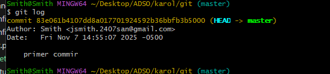
- `git branch`  
  Lista todas las ramas 
  
- `git branch nueva-rama`  
  Crea una nueva rama 
  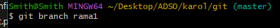
- `git switch`
  Se ubica en la rama de nombre ingresado 
  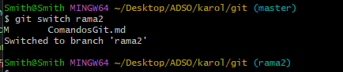
- `git checkout nueva-rama`  
  Se ubica en la rama de nombre ingresado 
  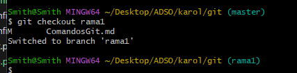
- `git checkout -b nueva-rama`  
  Crea una nueva rama y se ubica en esa automaticamente 
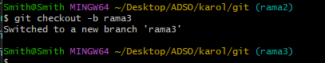
- `git merge rama-secundaria`  
  Fusiona la rama especificada con la actual. 
  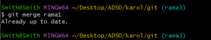
- `git branch -d rama-secundaria`  
  Elimina una rama local. 
  
  `git add remote URL github`
  Agrega un repositorio remoto 
  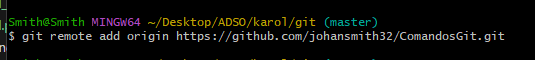
- `git remote -v`  
  Muestra los repositorios remotos configurados. 
  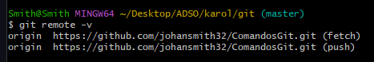

- `git push origin master`  
  Envía tus commits locales a la rama `master` del repositorio remoto. 
  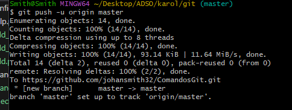
- `git pull origin master`  
  Trae y fusiona los cambios del repositorio remoto. 
  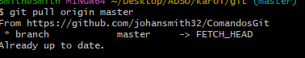
- `git fetch`  
  Descarga los cambios del remoto sin fusionarlos. 
  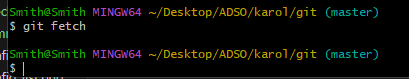
- `git diff`  
  Muestra las diferencias entre archivos modificados y el último commit. 
  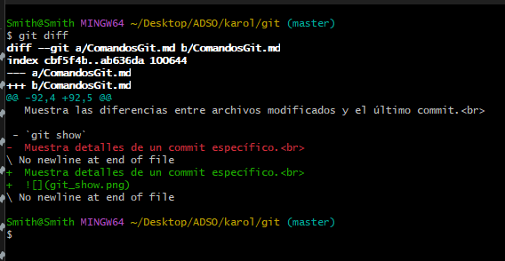

- `git show`  
  Muestra detalles de un commit específico. 
  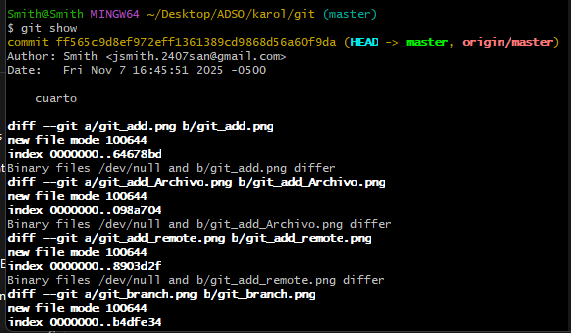