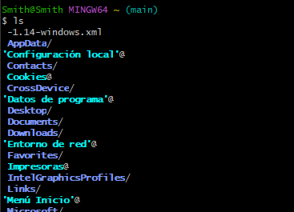
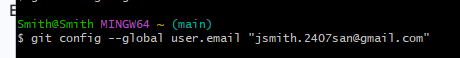
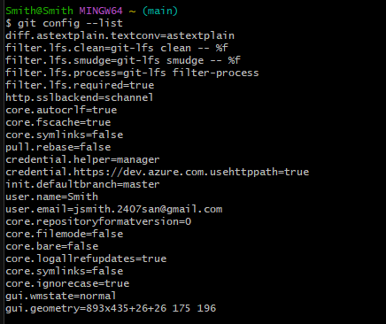
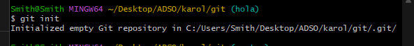
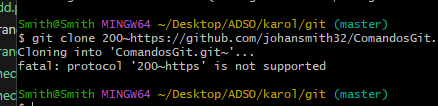
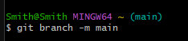
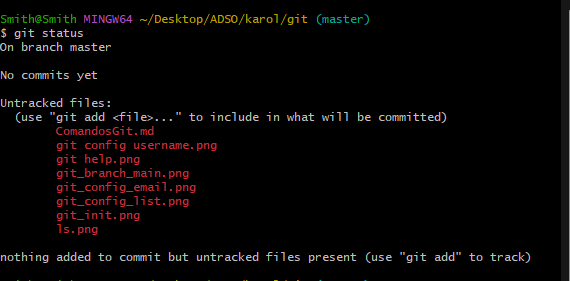

#  Comandos de GIT

- `git help`
  Muestra todos los comandos usables en git y muestra informacion general del git como la version
  
- `ls`
  Enlista todos los directorios disponibles
  
- `git config --global user.name "Tu Nombre"`  
  Define el nombre de usuario global para los commits.
  
- `git config --global user.email "tu@email.com"`  
  Define el correo electrónico global para los commits.
  
- `git config --list`  
  Muestra la configuración actual de Git.
  
- `git init`  
  Inicializa un nuevo repositorio Git en el directorio actual.
   
- `git clone https://github.com/usuario/repositorio.git`  
  Clona un repositorio local.
  
- `git branch -m "nombre"`
  Renombra la rama en la que esta ubicada la persona
  
- `git status`  
  Muestra el estado de los archivos (modificados, sin seguimiento, etc.).
  
- `git add archivo.txt`  
  Agrega un archivo específico al área de preparación (staging).

- `git add .`  
  Agrega todos los archivos modificados al área de preparación.

- `git reset archivo.txt`  
  Quita un archivo del área de preparación.

- `git commit -m "Mensaje del commit"`  
  Crea un commit con los archivos en staging y un mensaje descriptivo.

- `git commit -am "Mensaje"`  
  Agrega y commitea archivos ya rastreados en un solo paso.

- `git log`  
  Muestra el historial de commits.

- `git log --oneline`  
  Muestra el historial en una sola línea por commit.

##  Ramas
- `git branch`  
  Lista todas las ramas locales.

- `git branch nueva-rama`  
  Crea una nueva rama.

- `git checkout nueva-rama`  
  Cambia a otra rama.

- `git checkout -b nueva-rama`  
  Crea y cambia a una nueva rama en un solo paso.

- `git merge rama-secundaria`  
  Fusiona la rama especificada con la actual.

- `git branch -d rama-secundaria`  
  Elimina una rama local.

##  Remotos
- `git remote -v`  
  Muestra los repositorios remotos configurados.

- `git remote add origin https://github.com/usuario/repositorio.git`  
  Agrega un repositorio remoto llamado `origin`.

##  Push y Pull
- `git push origin main`  
  Envía tus commits locales a la rama `main` del repositorio remoto.

- `git pull origin main`  
  Trae y fusiona los cambios del repositorio remoto.

- `git fetch`  
  Descarga los cambios del remoto sin fusionarlos.

##  Limpieza y correcciones
- `git stash`  
  Guarda temporalmente los cambios no commiteados.

- `git stash pop`  
  Recupera los cambios guardados con `stash`.

- `git rm archivo.txt`  
  Elimina un archivo del repositorio y del sistema de archivos.

- `git diff`  
  Muestra las diferencias entre archivos modificados y el último commit.

- `git show`  
  Muestra detalles de un commit específico.